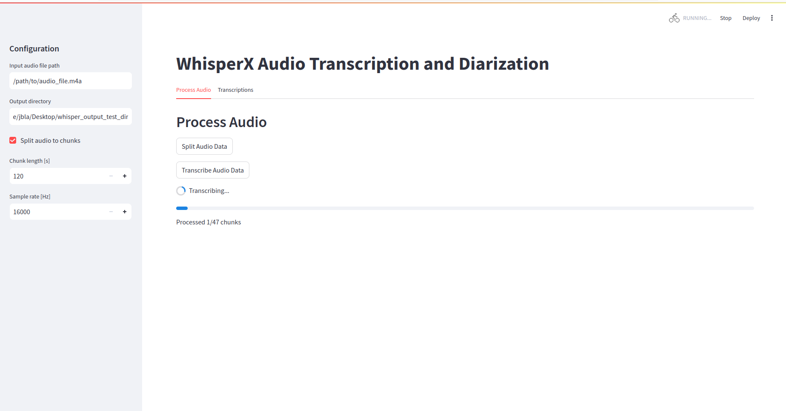
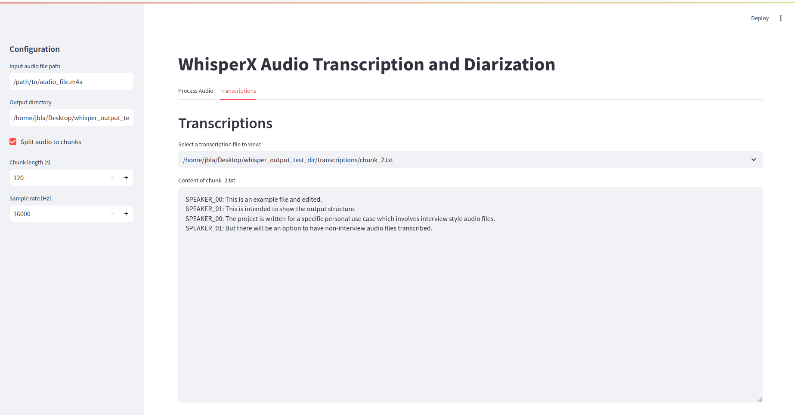

# Whisper Diarization Pipeline
This repository is a project for a specific personal use-case to split long audio
files to smaller chunks and transcribe them using whisper. Moreover, the audio files are
interview style audio files and therefore diarization is introduced.

